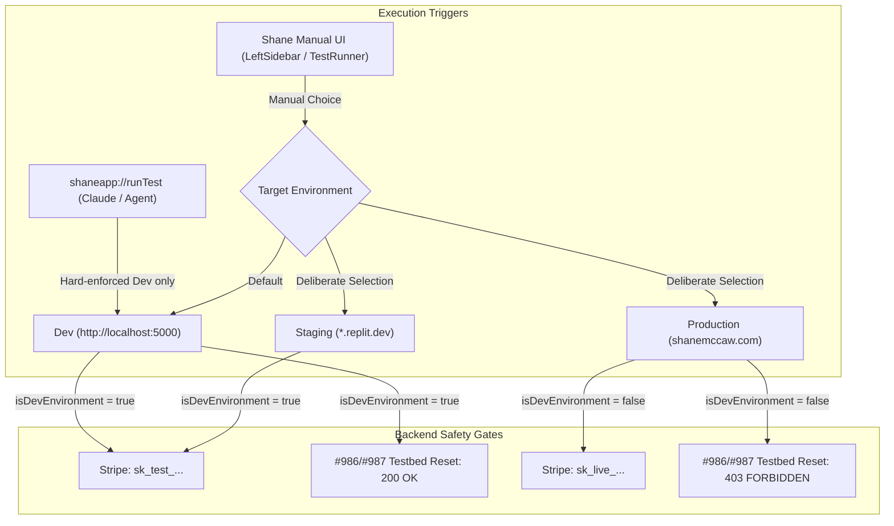

# Three-Tier Target Environment System & Agent Dev-Only Safety Boundary

This implementation plan introduces a first-class **Target Environment** system with three distinct tiers (**Dev**, **Staging**, **Production**), implements a hard-enforced Dev-only boundary for agent-driven/protocol executions (`shaneapp://runTest`, etc.), provides manual UI controls for Shane to target Staging/Production with persistent visual indicators and safety resets, and updates the backend Stripe key selection and #965/#986/#987 environment gates to recognize local Dev environments.

---

## User Review Required

> [!IMPORTANT]
> **Safety Boundary (Non-Negotiable)**
> - Agent-triggered test executions via `shaneapp://runTest` (and all protocol listeners) will **ALWAYS and ONLY** resolve to **Dev** (local). No query parameters or agent overrides will be accepted.
> - Staging and Production can **ONLY** be executed via explicit, manual UI interaction by Shane in the WPF app (e.g., selecting Staging/Production in the UI and clicking Play Test / Retry).
> - After a manual run against Staging or Production finishes, the target environment UI control will automatically reset back to **Dev** to prevent accidental subsequent runs against non-dev tiers.

> [!NOTE]
> **Environment URLs Configuration**
> - **Dev**: `http://localhost:5000` (configurable local API/App base URL)
> - **Staging**: `https://ba888680-2595-412d-84fe-4e9aefc2688b-00-22rhgh0krunr4.picard.replit.dev/` (existing Replit deployment)
> - **Production**: `https://shanemccaw.com` (real live domain)
> 
> These are stored as distinct config properties in `scripts/build-queue-watcher.config.json` (`devBaseUrl`, `stagingBaseUrl`, `productionBaseUrl`), with `apiBaseUrl` maintained for backward compatibility.

---

## Proposed Changes

---

### Component 1: WPF Application — Config & Environment Model

#### [NEW] [TargetEnvironment.cs](file:///c:/Source/ShaneMcCawConsulting/Shane-McCaw-MSP/desktop/BuildConsole/Services/TargetEnvironment.cs)
- Define `public enum TargetEnvironment { Dev, Staging, Production }`.

#### [MODIFY] [BuildTrackerConfig.cs](file:///c:/Source/ShaneMcCawConsulting/Shane-McCaw-MSP/desktop/BuildConsole/Services/BuildTrackerConfig.cs)
- Add `DevBaseUrl`, `StagingBaseUrl`, and `ProductionBaseUrl` properties.
- Add `GetBaseUrl(TargetEnvironment env)` helper.
- Add `ForEnvironment(TargetEnvironment env)` helper that creates a resolved config copy with `ApiBaseUrl` mapped to the selected environment's base URL.

#### [MODIFY] [build-queue-watcher.config.json](file:///c:/Source/ShaneMcCawConsulting/Shane-McCaw-MSP/scripts/build-queue-watcher.config.json)
- Add `"devBaseUrl": "http://localhost:5000"`, `"stagingBaseUrl": "https://ba888680-2595-412d-84fe-4e9aefc2688b-00-22rhgh0krunr4.picard.replit.dev/"`, `"productionBaseUrl": "https://shanemccaw.com"`.

#### [MODIFY] [HttpTestExecutor.cs](file:///c:/Source/ShaneMcCawConsulting/Shane-McCaw-MSP/desktop/BuildConsole/Services/HttpTestExecutor.cs)
- Ensure `ResolvePlaceholders` resolves `{{DEPLOY_URL}}` against the specific active `config.ApiBaseUrl` (which is resolved per-environment).

---

### Component 2: WPF Application — Hard-Enforced Agent Protocol Boundary

#### [MODIFY] [MainWindow.ShaneAppRunTest.cs](file:///c:/Source/ShaneMcCawConsulting/Shane-McCaw-MSP/desktop/BuildConsole/MainWindow.ShaneAppRunTest.cs)
- Hardcode the test execution call in `HandleShaneAppRunTestAsync` to `RunManifestAsync(manifest, isRegression: false, targetEnv: TargetEnvironment.Dev)`.
- Do not parse or accept any `env` or `target` query parameters.
- Log explicitly to `ShaneAppProtocol.LogChannel` that the run is locked to `TargetEnvironment.Dev (Local)`.

#### [MODIFY] [MainWindow.xaml.cs](file:///c:/Source/ShaneMcCawConsulting/Shane-McCaw-MSP/desktop/BuildConsole/MainWindow.xaml.cs)
- Update `RunManifestAsync` to take `TargetEnvironment targetEnv = TargetEnvironment.Dev`.
- Inside `RunManifestAsync`, derive `config = BuildTrackerConfig.Load().ForEnvironment(targetEnv)`.
- Pass this environment-resolved `config` to `HttpTestExecutor`, `ZohoTestExecutor`, `UiTestExecutor`, probe logic, and `TestbedGate`.
- Ensure `HandleShaneAppExecuteScanAsync` and `HandleShaneAppRunScanAsync` also resolve via `ForEnvironment(TargetEnvironment.Dev)`.

---

### Component 3: WPF Application — Manual UI Controls for Shane

#### [MODIFY] [LeftSidebar.xaml](file:///c:/Source/ShaneMcCawConsulting/Shane-McCaw-MSP/desktop/BuildConsole/Controls/LeftSidebar.xaml) & [LeftSidebar.xaml.cs](file:///c:/Source/ShaneMcCawConsulting/Shane-McCaw-MSP/desktop/BuildConsole/Controls/LeftSidebar.xaml.cs)
- Add a Target Environment selector in the `AutomationView` panel:
  - Radio/segmented buttons or ComboBox with 3 options: `Dev (Local)`, `Staging (Replit)`, `Production`.
  - Prominent visual badge indicating current selection:
    - **Dev**: Green `● DEV (Local)`
    - **Staging**: Amber `⚠️ STAGING`
    - **Production**: Red `🚨 PRODUCTION`
  - Pass the selected `TargetEnvironment` to `PlayTestRequested` event.
  - Reset selector back to `Dev` after the manual test run completes to ensure no accidental lingering state.

#### [MODIFY] [TestRunnerWindow.xaml](file:///c:/Source/ShaneMcCawConsulting/Shane-McCaw-MSP/desktop/BuildConsole/TestRunnerWindow.xaml) & [TestRunnerWindow.xaml.cs](file:///c:/Source/ShaneMcCawConsulting/Shane-McCaw-MSP/desktop/BuildConsole/TestRunnerWindow.xaml.cs)
- In the status header, display `TxtTargetEnvBadge` displaying `[DEV]`, `[STAGING]`, or `[PRODUCTION]` in appropriate colors.
- `Retry` button passes the same environment that was run or prompts if it was non-dev.

#### [MODIFY] [SettingsTabView.xaml](file:///c:/Source/ShaneMcCawConsulting/Shane-McCaw-MSP/desktop/BuildConsole/Controls/SettingsTabView.xaml) & [SettingsTabView.xaml.cs](file:///c:/Source/ShaneMcCawConsulting/Shane-McCaw-MSP/desktop/BuildConsole/Controls/SettingsTabView.xaml.cs)
- Add a "Target Environments & Base URLs" card in the Test Environment settings page allowing Shane to view and edit the Dev, Staging, and Production URLs.

---

### Component 4: Backend API Server — Local Dev Recognition in Environment & Stripe Gates

#### [MODIFY] [stripe.ts](file:///c:/Source/ShaneMcCawConsulting/Shane-McCaw-MSP/artifacts/api-server/src/lib/stripe.ts)
- Update `isReplitDevEnvironment()` (and export `isDevEnvironment()` alias) to classify as development if:
  - `REPLIT_DOMAINS` is absent or empty, OR
  - All domains in `REPLIT_DOMAINS` are dev domains (`.replit.dev`, `localhost`, `127.0.0.1`, `[::1]`, `*.local`, `*.internal`, `0.0.0.0`), OR
  - `process.env.APP_ENV === 'dev'` or `process.env.NODE_ENV === 'development'`.
- Ensure `getStripeKey()` and `getStripePublishableKey()` return `STRIPE_SECRET_KEY` (test key `sk_test_...`) for local Dev, and ONLY use `STRIPE_SECRET_KEY_PROD` for real production deployments.

#### [MODIFY] [env.ts](file:///c:/Source/ShaneMcCawConsulting/Shane-McCaw-MSP/artifacts/api-server/src/lib/env.ts)
- Update `isProductionEnvironment()` to align with `stripe.ts` so `localhost`/local dev is recognized as non-production.

#### [MODIFY] [admin-testbed.ts](file:///c:/Source/ShaneMcCawConsulting/Shane-McCaw-MSP/artifacts/api-server/src/routes/admin-testbed.ts)
- `requireDevOrigin` middleware will use the updated `isReplitDevEnvironment()`, allowing local Dev test execution to call `/api/admin/testbed/reset` and `/api/admin/testbed/teardown-graph-writes` while continuing to strictly 403-block against any real production deployment.

#### [MODIFY] [sync-stripe-webhooks.ts](file:///c:/Source/ShaneMcCawConsulting/Shane-McCaw-MSP/scripts/src/sync-stripe-webhooks.ts)
- Update domain check to recognize local dev domains.

---

### Component 5: Test Manifests Audit

- **Verification Summary**: Checked all 78 test manifests under `test-manifests/`.
- All test manifests use `"baseUrl": "{{DEPLOY_URL}}"`, which dynamically resolves to the target environment's base URL (`devBaseUrl`, `stagingBaseUrl`, or `productionBaseUrl`). No hardcoded host URLs were found in manifest step targets.

---

## Verification Plan

### Automated Build Verification
1. `dotnet build -c Release` in `desktop/BuildConsole` to verify C# compilation with 0 errors.
2. `pnpm run typecheck` in workspace root to verify TypeScript typing in `artifacts/api-server` and `scripts`.

### Manual & Protocol Verification
1. **Agent Protocol Isolation**:
   - Trigger `shaneapp://runTest?file=smoke/hello-world-ui.json` and verify in logs that the execution targets `http://localhost:5000` (Dev) regardless of UI state.
2. **Manual UI Execution**:
   - Verify that LeftSidebar displays the Target Environment options (Dev, Staging, Production).
   - Test that selecting Staging/Production updates the visual badge and runs against the configured Staging/Production URL, then safely resets back to Dev.
3. **Stripe & Testbed Gates**:
   - Verify unit tests in `artifacts/api-server` (e.g. `stripe.test.ts`, `admin-testbed.ts`) pass and confirm `localhost` is treated as a dev context with `sk_test_...` key selection and allowed testbed resets.
